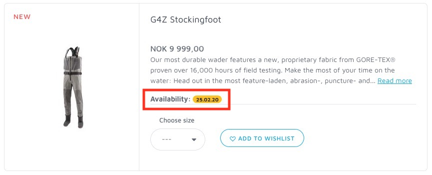

# FFE Product info widget

## TL;DR


Include this on your webpage for each product you want to display availability:

```html
<div data-widget-host="ffe-product-info" data-prop-prefix="Remote stock:" data-prop-articleno="12447-059-50"></div>

```

#### Options

| Options             | Type   | Description |
|---------------------|--------|-------------------------------------------------------------------------------------------------|
| data-widget-host    | string | This is the container identifier. Do NOT change this.
| data-prop-prefix    | string | This is the text in front of the availability badge. Can be whatever you like.
| data-prop-articleno | string | This is the products article number from Flyfish Europe. Placeholder in example is `ffe-product-number`.


Include this at the bottom of the page:
```html
<script async src="https://flyfisheurope.com/bundle/ffe-product-info-bundle.js"></script>
```

### Example usage

From Flyfish Europes productlist:



## Development

When you are running in dev mode you can see your application here:
http://localhost:8080

```bash
# To start a development live-reload server:
$ npm run start
```


## Build a release

```bash
# To create a production build (in ./build):
$ npm run build
```


## Production server

```bash
# To start a production HTTP/2 server:
$ npm run serve
```


### Howto upgrade modules
```bash
$ sudo npm install -g npm-check-updates
$ ncu -u -a
$ npm install --no-optional
```

### Versioning
For transparency and insight into the release cycle, releases will be
numbered with the follow format:

`<major>.<minor>.<patch>`

And constructed with the following guidelines:

* Breaking backwards compatibility bumps the major
* New additions without breaking backwards compatibility bumps the minor
* Bug fixes and misc changes bump the patch

For more information on semantic versioning, please visit http://semver.org/.


## Contributions and feedback:

We ❤️ contributions and feedback.

If you want to contribute, please check out the [CONTRIBUTING.md](CONTRIBUTING.md) file.

If you have any question or suggestion create an issue.

Bug reports should always be done with a new issue.
